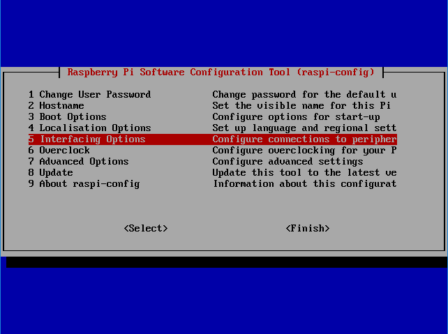
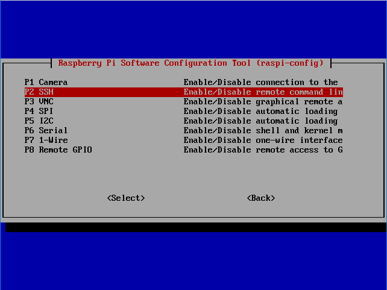
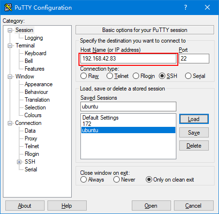
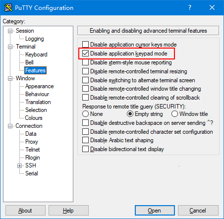
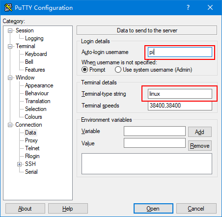
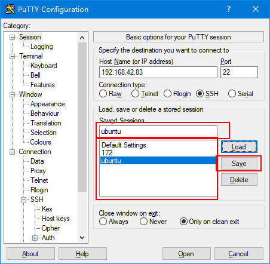
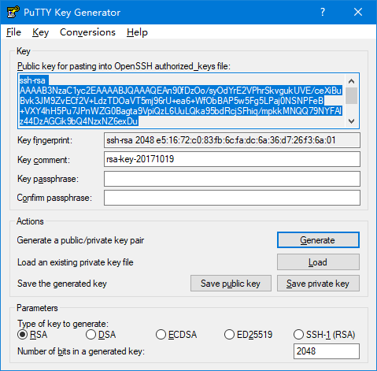
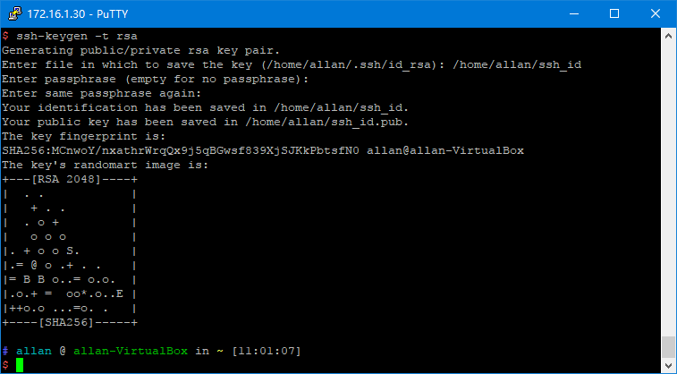
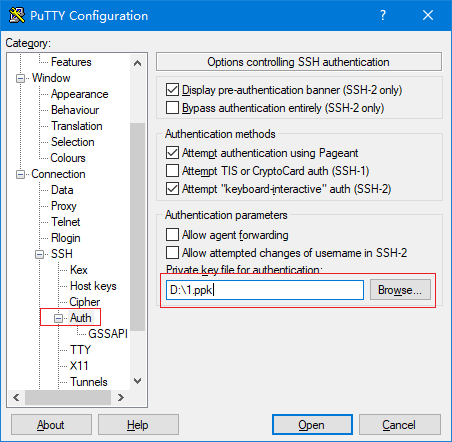

# 打开SSH服务
1. 执行raspi-config
```sh
sudo raspi-config
```
2. 选择Interfacing Options选项，回车  
  

3. 选择SSH，回车  
  

# Windows下客户端

推荐使用putty这个免费开源的SSH客户端。[下载地址](https://www.chiark.greenend.org.uk/~sgtatham/putty/latest.html)

  
   在红框处填入树莓派的IP地址，点击右下角的Open即可。
不过，putty的默认配置并非最优，需要做以下修改：
1. 解决无法使用小键盘的问题  
  
2. 自动登录账号，解决无法使用home和end键的问题  
  
  不过，依旧需要输入账号密码。至于如何免密码登录，见后文。

3. 保存设置
  回到Session页面，选中要保存的Session或者新建一个Session，点击右侧的Save。  
  

注：如果修改原来的配置，需要先选中之前保存的Session，点击右侧的Load按钮加载，然后修改完成后再点击Save。关于这一点，putty的界面设计与其他软件存在较大差异。

# Linux下客户端
在Linux下可以直接使用ssh命令连接。当然，在ssh下面可以使用putty。linux下的putty与Windows下完全相同。

例如：
```sh
ssh 192.168.42.83
ssh pi@192.168.42.83
```
不过，这样登录后的ssh可能无法显示中文目录名（当然，有办法解决，只是我太懒了）。所以，还是推荐使用putty。

# 免密码登陆
## Windows下生成认证文件
如果想免密码登陆需要使用认证文件。
在Windows下可以通过PuTTY gen这个工具生成。

1. 点击Generate
2. 在窗口中来回晃动鼠标，直到进度条走到头
3. 【可选】在Key passphrase中设置一个密码。
4. 点击Save private key，保存private key文件为ssh_id.ppk
5. 点击Save public key，保存public key文件为ssh_id
6. 关掉PuTTY gen

## Linux下生成认证文件
```sh
ssh-keygen -t rsa
```


其中   
-  Private key文件为/home/allan/ssh_id中  
-  Public key文件为/home/allan/ssh_id.pub中  
### 生成ppk文件
```sh
 puttygen ssh_id -o ssh_id.ppk
```
## SSH服务器端使用Public key
将生成的Public key文件复制到服务器端的~/.ssh/authorized_keys中。
### 方法1
使用ssh登录树莓派，然后执行
```sh
nano ~/.ssh/authorized_keys
```
1. 将ssh_id的内容粘贴进去  
  如果已经存在authorized_keys文件，新起一行追加到文件的尾部即可。
2. 按CTRL+X保存并退出
3. 执行`sudo systemctrl reboot`重启树莓派(当然，也可以重启ssh服务器，具体方法自己查，我懒)
### 方法2
如果使用的是linux，可以执行直接使用下面的命令：
```sh
ssh-copy-id -i ~/ssh_id pi@192.168.42.83
```
然后，重启树莓派即可。

## 客户端使用Private key  
### PuTTY	 

注意：先在session页面中Load现有的session，然后再设置private key。    
设置完成后再回到session页面Save。  

接下来，双击session即可免密码登陆。

### ssh  
如果在linux下使用的是ssh，可以通过修改~/.ssh/config指定Private key文件
如果没有这个文件，可以从/etc/ssh/ssh\_config中复制一个。  
当然，也可以直接改/etc/ssh/ssh\_config。只是/etc/ssh/ssh\_config是全局的，而~/.ssh/config是当前用户的。

将`#    IdentityFile ~/.ssh/id_rsa`这一行取消，后面的文件名改正你只记得文件名即可，例如~/ssh_id
